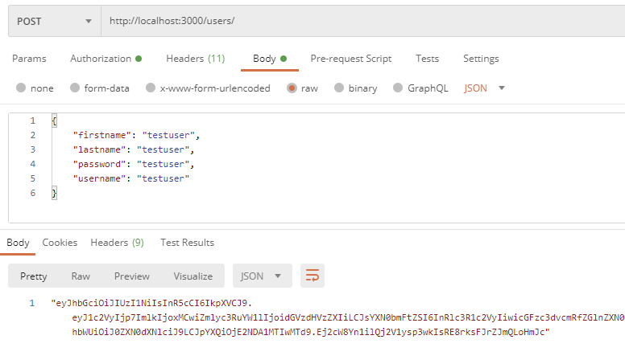
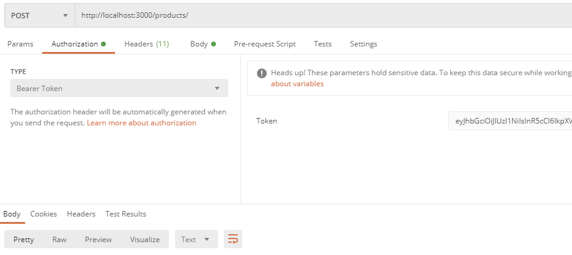
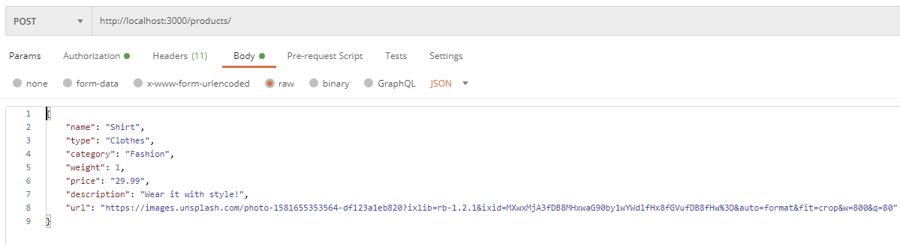

# MyStore

Angular E-commerce application.

## Backend API

The backend API used to retrieve the products data can be found at https://github.com/Mttds/Nodejs-Store-Backend-API. CORS (https://developer.mozilla.org/en-US/docs/Web/HTTP/CORS) has been set to allow requests coming from http://localhost:4200 (host and port where this Angular application will be running). The service on http://localhost:3000 (i.e the Backend API) should be running in order to retrieve data from the Angular application (check the repo for info on how to set it up).

To have some data to display to the Angular front-end the file ./src/assets/data.json can be used to make POST requests to the http://localhost:3000/products endpoint (check the repo to see how to acquire a valid JWT token to make POST requests).

### Steps for deployment
1) Download and install postgresql on your machine https://www.postgresql.org/download/. Make sure that the PATH is configured correctly (i.e `export PATH=/usr/lib/postgresql/13/bin/:${PATH}` with postgresql version 13, you can run `which pg_config` to check if postgres is recognized as a system command) and check that the pg cluster is running with `ps -ef | grep postgres | grep -v grep`. Start it with `sudo pg_ctlcluster 13 main start` if the previous command did not return anything. Postgres will run on port 5432 by default. 
2) Download the repo with `git clone https://github.com/Mttds/Nodejs-Store-Backend-API.git` and install the packages with `npm install`
3) Create the database user for the backend application: `sudo -u postgres createuser -s full_stack_dev`
4) Connect to the database with `sudo -u postgres psql` and assign the password `CREATE ROLE full_stack_dev LOGIN PASSWORD '<password>';`. If it returns an error because the role was already created at user creation then run the command `ALTER USER full_stack_dev PASSWORD '<password>';`
5) Create the database instance: `CREATE DATABASE full_stack_dev;`
6) Assign full privileges `GRANT ALL PRIVILEGES ON DATABASE full_stack_dev to full_stack_dev;`
7) Run the db migration from the project root directory to create the required objects (tables, sequences, ...): `node node_modules/db-migrate up`
8) Grant privileges to tables and sequences if missing: `GRANT SELECT,INSERT,DELETE,UPDATE ON ALL TABLES IN SCHEMA public TO full_stack_dev;` and `GRANT ALL PRIVILEGES ON ALL SEQUENCES IN SCHEMA public TO full_stack_dev;`
9) Run the application with `npm run start` (builds it and then runs it on localhost port 3000)
10) Create a User using Postman or another similar tool to make HTTP requests and get the JWT Token from the body response.

11) Create the products in the database which will be visible in the front-end by issuing POST requests with the sample ./src/assets/data.json. Remember to set the Authentication Bearer to the acquired JWT token.

Now it should be possible to start the Angular application (check 'Start the application' section) and see the inserted products in the browser at http://localhost:4200.

#### Project features

The application reflects the same user experience as that of a real-world e-commerce website, including a(n):

* **Product list** page, which displays the available products for the user to choose and add to their cart (in various quantities)
* **Product details** page, which displays more information about any particular product
* **Shopping cart**, which includes the products that the user has added to their cart
* **Checkout form**, which collects information about the user (e.g., name, address, payment details, etc.)
* **Order confirmation page**, which shows the outcome after the user completes the checkout process (i.e., submits the checkout form)

#### Start the application

After downloading the repo use `npm install` in the project root (where package.json is) to install the required dependencies.
Once the dependencies are installed the application can be served using the Angular built-in webserver with `ng server`.

## License

[License](LICENSE.txt)